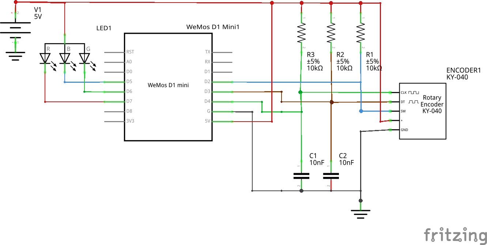

# RGB led strip control with Apple Home

I am using a modified version of [igorantolic's ai-esp32-rotary-encoder](https://github.com/igorantolic/ai-esp32-rotary-encoder).

## Rotary encoder behavior

The rotary encoder is used to set the RGB led strip brightness and color. It also turns it off and on. Once powered on, the initial value is to set the brightness. The brightness starts at 100% (maximum).
* A short click (200ms) changes the rotary encoder behavior to set random colors on the led.
* A long click (500ms) controls the led strip power.

Each time you modify a value, say, brightness, power, or color, the HomeKit API is notified about it hence also updated in the Home app.

## Schematic
The schematic is fairly easy to understand. I've added some capacitors to the CLK and DT pins of the rotary encoder to help ease with the spurious noise, also coupled with 10k Ohms pull-up resistors.

